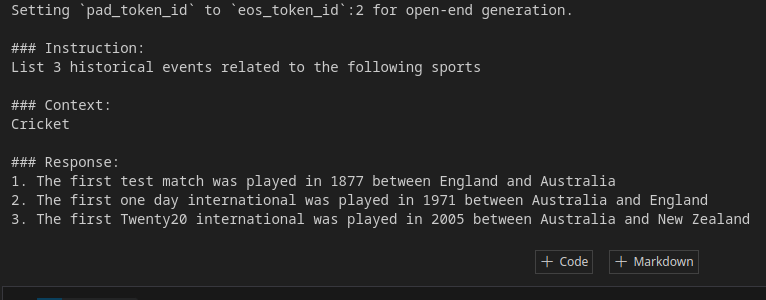

<div align="center">

# Fine-Tuning Model using QLoRa and Deploying via vLLM on KServe

</div>

# Overview
In this repository, we fine-tune the [DeciLM-7B base model](./images/deci7b.png). This is deployed using vLLM on KServe. A Next.js front-end is deployed on  Vercel.


# Demo
[](https://www.youtube.com/embed/T9CuVU-lo_c)


# Fine-tuning

To fine-tune the model, run
```bash
python s26_sft.py
```

We can see the difference in the base model and instruction-tuned model

Before:  


After:  


The fine-tuned model is then pushed to an S3 bucket.

## Docker

We build a custom docker image for serving with vLLM on KServe. This uses the `vllm/vllm-openai` image, uses a chat template. Given that the pip release didn't support DeciLM at the time of this work, support for DeciLM was manually added via the vLLM's model definition files.


## Deployment
After installing minikube, kubectl, and KServe (via quickinstall), we can deploy our model via

```
kubectl apply -f s3_sa.yaml
kubectl apply -f vllm.yaml
```
For deployment/inference, we use the `openai api_server` entrypoint.

To expose the ingress gateway on the host, we can use

```
kubectl port-forward --namespace istio-system svc/istio-ingressgateway 8080:80 --address=0.0.0.0
```

To get an HTTPS endpoint, we can use ngrok:

```bash
ngrok http --host-header="vllm.default.example.com" --domain={my_ngrok_domain}.app 8080
```

Since we are passing the custom header via ngrok, we don't need to (in fact, we shouldn't!) add them to our curl or python/Next.js apis.
## Benchmark

For this, we use the `api_server` entrypoint.

```bash
kubectl apply -f vllm_gen.yaml
```


```bash
wget https://huggingface.co/datasets/anon8231489123/ShareGPT_Vicuna_unfiltered/resolve/main/ShareGPT_V3_unfiltered_cleaned_split.json

# this just downloads the tokenizer, not the entire model!
python benchmark.py --backend vllm  --dataset ./ShareGPT_V3_unfiltered_cleaned_split.json --tokenizer "ainoob101/deci-7b-dolly-qlora" --request-rate 5
```


